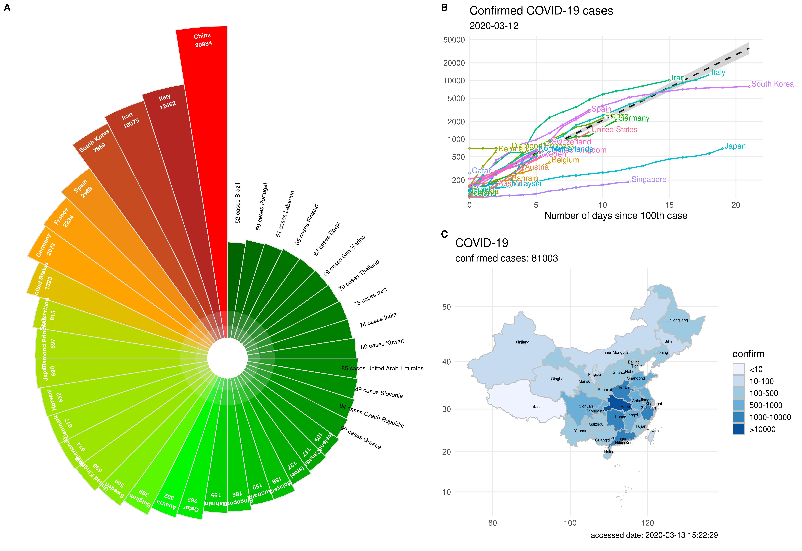

# nCov2019: An R package with real-time data, historical data and Shiny app

## :house: Data Sources

#### Real-time data 

+ [Tencent SARS-COV-2 website](https://news.qq.com/zt2020/page/feiyan.htm). 

#### Historical data (three public data sources):

1. [Wuhan-2019-nCoV GitHub repository](https://github.com/canghailan/Wuhan-2019-nCoV).  

   - This data source contains detailed city level data in China, and country level data in worldwide.

2. [National Health Commission of the People’s Republic of China](http://www.nhc.gov.cn/xcs/yqtb/list_gzbd.shtml) 

    - This data source contains province level data in China.

3. [DXY.cn. Pneumonia. 2020.](https://ncov.dxy.cn/ncovh5/view/pneumonia) 

    - We collect historical city level data in China from this source.

4. [今日头条](https://i.snssdk.com/ugc/hotboard_fe/hot_list/template/hot_list/forum_tab.html)

    - We collect historical province level data for oversea countries form this source. (Start from 2020-03-15)

      The user can obtain the historical provincial data in  `China`, `South Korea`, `United States`, `Japan`, `Iran`, `Italy`, `Germany` and  `United Kingdom`  now.

      For example, the below will return the historical data for Italy. 

      ```r
      library(nCov2019)
      nCov2019_set_country(country = 'Italy') 
      x['province'] # this will return Italy data only.
      ```

**For more details see our [vignette](https://guangchuangyu.github.io/nCov2019/), [Preprint](https://www.medrxiv.org/content/10.1101/2020.02.25.20027433v2), and [Shiny app](http://www.bcloud.org/e/).**


## :writing\_hand: Authors

+ Guangchuang YU (package creator and maintainer)
    - School of Basic Medical Sciences, Southern Medical University
    - <https://guangchuangyu.github.io>
+ Xijin Ge (Shiny app)
    - Department of Mathematics and Statistics, South Dakota State University
    - <https://www.sdstate.edu/directory/xijin-ge>
+ Tianzhi Wu, Erqiang Hu and Patrick Tung (contributors)


If you use `nCov2019`, please cite the following preprint:

Tianzhi Wu, Erqiang Hu, Xijin Ge<sup>\*</sup>, Guangchuang Yu<sup>\*</sup>. [Open-source analytics tools for studying the COVID-19 coronavirus outbreak](https://www.medrxiv.org/content/10.1101/2020.02.25.20027433v2). **medRxiv**, 2020.02.25.20027433. doi: <https://doi.org/10.1101/2020.02.25.20027433> 


## :arrow\_double\_down: Installation

Get the development version from github:

``` r
## install.packages("remotes")
remotes::install_github("GuangchuangYu/nCov2019")
```

+ `get_nCov2019()` to query online latest information
+ `load_nCov2019()` to get historical data
+ `nCov2019_set_country()` to set  country options
+ `summary` and `[` to access data
+ `plot` to present data on map
+ `dashboard()` to open Shiny app dashboard

## :art: Example

Run the script [example.R](example.R) in R using `source("example.R")`, will produce the following figure:



## :book: Documents

+ **online vignette**: [nCov2019 for studying COVID-19 coronavirus outbreak](https://guangchuangyu.github.io/nCov2019/)
+ [An R Package to Explore the Novel Coronavirus](https://towardsdatascience.com/an-r-package-to-explore-the-novel-coronavirus-590055738ad6)
+ [检索疫情数据的R包来了](https://mp.weixin.qq.com/s/_0D8ENb-4lGm4UV16Ok28A)
+ [各省市的疫情历史数据来了！](https://mp.weixin.qq.com/s/lrQWGKj-mReWrxfi_4Sw9A)
+ [一次搞定所有的疫情地图](https://mp.weixin.qq.com/s/iWyOvOoLDl2q9VCUEDY52A)
+ [nCov2019：历史数据实现自动更新](https://mp.weixin.qq.com/s/wTqeSVWZCH3YP8YzAj20EQ)
+ [nCov2019英文版，歪果仁也能用这次武汉疫情的数据了](https://mp.weixin.qq.com/s/u50yCKAGJfrcXgvHHhLbsA)
+ [新冠全球历史数据来了](https://mp.weixin.qq.com/s/tTmd7IJt9U9en62Hl1kBnw)
+ [当病毒R包nCov-2019遇上动图gganimate](https://mp.weixin.qq.com/s/54cAS4jOJEJw3_SvRJUjDg)
+ [爆款风玫瑰图：新冠肺炎全球疫情形势](https://mp.weixin.qq.com/s/ZIZr9zmxVIqjlAFQdK-t7A)
+ [螺旋的疫情图](https://mp.weixin.qq.com/s/lY1TpDqrMce5fB0_GsTlgA)
+ [欧洲很方，一不小心都要「意大利」了](https://mp.weixin.qq.com/s/m1FW20a7RJUhZ7MISkPrrg)


## :chart\_with\_upwards\_trend: Shiny Apps that use `nCov2019`

+ [Coronavirus Tracking dashboard](https://coronavirus.john-coene.com/)
+ [Novel Coronavirus Pneumonia (NCP-2019) Dashboard](https://github.com/gaospecial/NCPdashboard)
+ [Coronavirus COVID-19 outbreak statistics and forecast](http://www.bcloud.org/e/)
+ [新冠状病毒统计和预测](http://www.bcloud.org/v/)
+ [新冠肺炎疫情分析平台](http://14.215.135.56:3838/COVID-19-public/)

## :sparkling\_heart: Collected in resource list

+ [Open-Source-COVID-19](https://weileizeng.github.io/Open-Source-COVID-19/)
+ [Top 7 R resources on COVID-19 Coronavirus](https://www.statsandr.com/blog/top-r-resources-on-covid-19-coronavirus/)
+ [COVID-19 Coronavirus Disease resources](http://covirusd.com/resources/)

