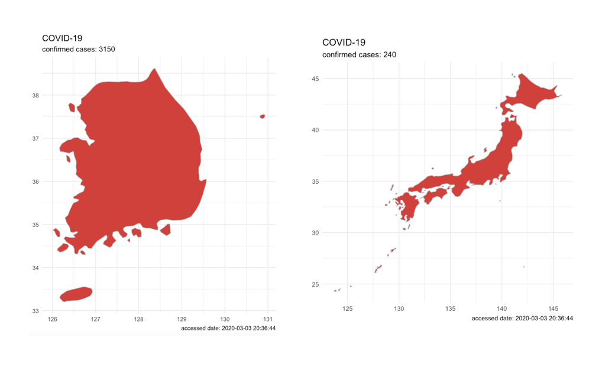
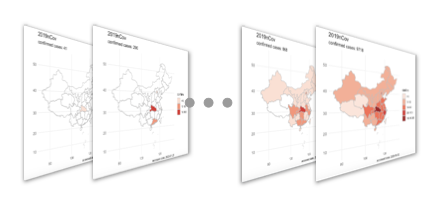
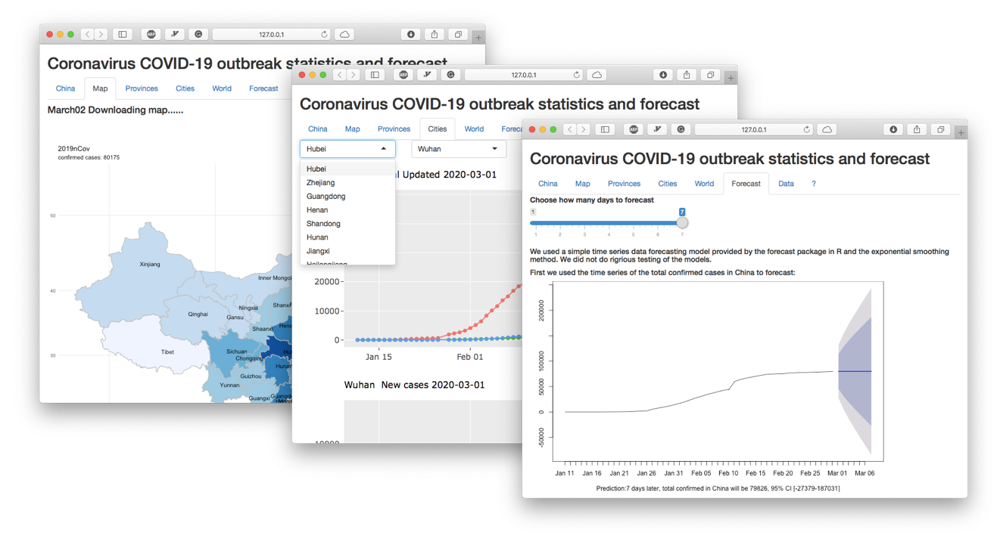

```{r setup, include=FALSE}
library(knitr)
knitr::opts_chunk$set(echo = TRUE)
opts_knit$set(progress=FALSE, verbose=FALSE) 
opts_chunk$set(comment=NA, warning=FALSE, message=FALSE) 
```


To provide convenient access to epidemiological data on the coronavirus outbreak, we developed an R package, nCov2019 (https://github.com/GuangchuangYu/nCov2019). Besides detailed real-time statistics, it also includes historical data in China, down to the city-level. We also developed a website (http://www.bcloud.org/e/) with interactive plots and simple time-series forecasts. These analytics tools could be useful in informing the public and studying how this and similar viruses spread in populous countries.

# Installation

To start off, users could utilize the ‘remotes’ package to install it directly from GitHub by running the following in R:

```{r,eval=FALSE, warning=FALSE, include=TRUE}
library('remotes')
remotes::install_github("GuangchuangYu/nCov2019", dependencies = TRUE)
```


# Query the latest data

To query the latest data, you can load it in with `get_nCov2019()`. By default, the language setting is automatically set to Chinese or English based on the user's system environment. Of course, users can also use parameter `lang = 'zh'`  or `lang = 'en'`  to set it explicitly.  

Since most of confirmed cases concentrated in China, researchers may more concern about the details in China. So, print the object `x`, you could get the total number of confirmed cases in China. 

```{r}
library('nCov2019')
x <- get_nCov2019(lang = 'en')
x 
```


And then you could use `summary(x)`  to get recent Chinese data.

```{r}
head(summary(x))
```


 

While no region is specified, `x[]` will return the provincial level outbreak statistics in China.

```{r}
head(x[]) 

```

 

To obtain a more granular scale data, you only need to specify the province name. For example, to obtain data in Hubei Province.

```{r}
head(x['Hubei'])

```


 

In addition, by using the argument `by = 'today'`, the number of newly added cases will be return.

```{r}
head(x['Hubei', by = 'today'])

```


Getting global data is also easy, by using `x['global']`, the data frame for the global landscape view of each country will be returned. 

```{r}
head(x['global'])

```


If you wanted to visualize the cumulative summary data, an example plot could be the following:

```r
d <- summary(x)
```

```{r echo =F}
#tencent duplicated 3.11, the second one should be 3.12
## should be fixed in future.

d <- summary(x) 
d <- d[d$date < '03.11', ]
```

```{r,fig.width=6.69, fig.height=4.45}
library(ggplot2)

ggplot(d, 
       aes(as.Date(date, "%m.%d"), as.numeric(confirm))) +
  geom_col(fill = 'firebrick') + 
  theme_minimal(base_size = 14) +
  xlab(NULL) + ylab(NULL) + 
  scale_x_date(date_labels = "%Y/%m/%d") +
  labs(caption = paste("accessed date:", time(x)))
```


And the bar-plot of the latest confirmed diagnosis in Anhui province could be plotted as follow:

```{r,fig.width=6.69, fig.height=4.45}
library(ggplot2)
d = x['Anhui', ] # you can replace Anhui with any province
d = d[order(d$confirm), ]
ggplot(d, aes(name, as.numeric(confirm))) +
  geom_col(fill = 'firebrick') + 
  theme_minimal(base_size = 14) +
  xlab(NULL) + ylab(NULL) +
  labs(caption = paste("accessed date:", time(x))) + 
  scale_x_discrete(limits = d$name) + coord_flip()
```


# Access detailed historical data

The method for accessing historical data is basically the same as getting the latest data, but entry function is `load_nCov2019()`. 

```{r}
library('nCov2019')
y <- load_nCov2019(lang = 'en')
y  # this will return update time of historical data
```


For the historical data, currently, we maintain three historical data,  one of which is collected and organized from GitHub repo, user will access it by default, or use `load_nCov2019(source = 'github')`  to get it. 

The second one is obtained from an Chinese website Dingxiangyuan and user could access it by using  `load_nCov2019(source = 'dxy')`. And the last one is obtained from the National Health Commission of Chinese, user could get it by using argument `source = 'cnnhc'`. The forms of these data are basically the same, but the default data source has more comprehensive global historical information and also contains older historical data. Users can compare and switch data from different sources.

```{r,fig.width=6.69, fig.height=4.45}
# compare the total confirmed cases in china between data sources
library(nCov2019)
library(ggplot2)
nCov2019_set_country('China')
y = load_nCov2019(lang = 'en', source = 'github')
dxy = load_nCov2019(lang = 'en', source = 'dxy')
nhc = load_nCov2019(lang = 'en', source = 'cnnhc')
dxy_china <- aggregate(cum_confirm ~ + time, summary(dxy), sum)
y_china <- aggregate(cum_confirm ~ + time, summary(y), sum)
nhc_china <- aggregate(cum_confirm ~ + time, summary(nhc), sum)
dxy_china$source = 'DXY data'
y_china$source = 'GitHub data'
nhc_china$source = 'NHC data'
df = rbind(dxy_china, y_china, nhc_china)
ggplot(subset(df, time >= '2020-01-11'),
    aes(time,cum_confirm, color = source)) +
  geom_line() + scale_x_date(date_labels = "%Y-%m-%d") + 
  ylab('Confirmed Cases in China') + xlab('Time') + theme_bw() +
  theme(axis.text.x = element_text(hjust = 1)) +
  theme(legend.position = 'bottom') 
```


Then you can use `summary(y)` to get historical data at the provincial level in China:

```{r}
head(summary(y))

```


To get historical data for all cities in China, you can use `y[]` as follow:

```{r}
head(y[]) 

```


You can also specify a province name to get the corresponding historical data, for example, extracting historical data from Anhui Province:

```{r}
head(y['Anhui'])

```


Similarly, you can get global historical data by specifying the `'global'` parameter.

```{r}
y <- load_nCov2019(lang = 'en', source='github')
d <- y['global']
tail(d)
```

**NOTE: The global historical data is not available from source `'dxy'`.**

 

Here are some visualization examples with the historical data. 

1. Draw a curve reflecting the number of deaths, confirms, and cures in China.

```{r,fig.width=6.69, fig.height=4.45}
library('tidyr')
library('ggrepel')
library('ggplot2')
y <- load_nCov2019(lang = 'en')
d <- subset(y['global'], country == 'China')
d <- gather(d, curve, count, -time, -country)
ggplot(d, aes(time, count, color = curve)) +
  geom_point() + geom_line() + xlab(NULL) + ylab(NULL) +
  theme_bw() + theme(legend.position = "none") +
  geom_text_repel(aes(label = curve), 
    data = d[d$time == time(y), ], hjust = 1) +
  theme(axis.text.x = element_text(angle = 15, hjust = 1)) +
  scale_x_date(date_labels = "%Y-%m-%d", 
    limits = c(as.Date("2020-01-15"), as.Date("2020-03-20"))) +
  labs(title="Number of deaths, confirms, and cures in China") 
```


2. Outbreak Trend Curves of Top ten Countries Around the World (except China).

```{r,fig.width=6.69, fig.height=4.45}
library('ggrepel')
library('ggplot2')
y <- load_nCov2019(lang = 'en')
df <- y['global']
d <- subset(df,country != 'China' & time == time(y))
t10 <- d[order(d$cum_confirm,decreasing = T),]$country[1:10]
df <- df[which(df$country %in% t10),]

ggplot(df, aes(time, as.numeric(cum_confirm), 
    group = country, color = country)) +
  geom_point() + geom_line() +
  geom_label_repel(aes(label = country), 
    data = df[df$time == time(y), ], hjust = 1) +
  theme_bw() + theme(legend.position = 'none') +
  xlab(NULL) + ylab(NULL) + 
  scale_x_date(date_labels = "%Y-%m-%d",
    limits = c(as.Date("2020-02-01"), as.Date("2020-03-19"))) +
  theme(axis.text.x = element_text(angle = 15, hjust = 1)) +
  labs(title = "Outbreak Trend Curves of Top 10 Countries Around the World \n (except China)")
```


3. Growth curve of confirms in Anhui Province, China.

```{r,fig.width=6.69, fig.height=4.45}
y <- load_nCov2019(lang = 'en')
d <- y['Anhui']
ggplot(d, aes(time, as.numeric(cum_confirm), 
    group = city, color = city)) +
  geom_point() + geom_line() + 
  geom_label_repel(aes(label = city), 
    data = d[d$time == time(y), ], hjust = 1) +
  theme_minimal(base_size = 14) + theme(legend.position = 'none') + 
  scale_x_date(date_labels = "%Y-%m-%d") + xlab(NULL) + ylab(NULL) + 
  theme(axis.text.x = element_text(hjust = 1)) +
  labs(title = "Growth curve of confirms in Anhui Province, China")
```


4. A heatmap of epidemic situation around the world in the last 7 days.

```{r,fig.width=6, fig.height=12}
library(ggplot2)
y <- load_nCov2019(lang = 'en')
d <- y['global']
max_time <- max(d$time)
min_time <- max_time - 7
d <- na.omit(d[d$time >= min_time & d$time <= max_time,])
dd <- d[d$time == max(d$time, na.rm = TRUE),]
d$country <- factor(d$country, 
  levels=unique(dd$country[order(dd$cum_confirm)]))
breaks = c(10, 100, 1000, 10000)
ggplot(d, aes(time, country)) + 
  geom_tile(aes(fill = cum_confirm), color = 'black') + 
  scale_fill_viridis_c(trans = 'log', breaks = breaks, 
  labels = breaks) + 
  xlab(NULL) + ylab(NULL) +
  scale_x_date(date_labels = "%Y-%m-%d") + theme_minimal()
```

The user could get province level data beside China, we current have collected province level information in China, South Korea, United States, Japan, Iran, Italy, Germany and United Kingdom.
To get the detail of any country of them, you only need to set the country env as follow:
```{r}
nCov2019_set_country('Italy') 
y <- load_nCov2019(lang = 'en', source = 'github')
head(y['province']) # This will return province data of Italy
```


5. Windrose plot of global confirm cases 


```{r}
require(nCov2019)
y <- load_nCov2019(lang = 'en', source='github')
d = y['global']


require(dplyr)
dd <- filter(d, time == time(y)) %>% 
    arrange(desc(cum_confirm)) 

dd = dd[1:40, ]
dd$country = factor(dd$country, levels=dd$country)

dd$angle = 1:40 * 360/40
require(ggplot2)
p <- ggplot(dd, aes(country, cum_confirm, fill=cum_confirm)) + 
    geom_col(width=1, color='grey90') + 
    geom_col(aes(y=I(5)), width=1, fill='grey90', alpha = .2) +       
    geom_col(aes(y=I(3)), width=1, fill='grey90', alpha = .2) +    
    geom_col(aes(y=I(2)), width=1, fill = "white") +
    scale_y_log10() + 
    scale_fill_gradientn(colors=c("darkgreen", "green", "orange", "firebrick","red"), trans="log") + 
    geom_text(aes(label=paste(country, cum_confirm, sep="\n"), 
                  y = cum_confirm *.8, angle=angle), 
            data=function(d) d[d$cum_confirm > 700,], 
            size=3, color = "white", fontface="bold", vjust=1)  + 
     geom_text(aes(label=paste0(cum_confirm, " cases ", country), 
                  y = max(cum_confirm) * 2, angle=angle+90), 
            data=function(d) d[d$cum_confirm < 700,], 
            size=3, vjust=0) + 
    coord_polar(direction=-1) + 
    theme_void() + 
    theme(legend.position="none") +
    ggtitle("COVID19 global trend", time(y))
```


```r
print(p)
```

```{r globalwindrose, echo=FALSE, fig.width=8.4, fig.height=10.6}
if (nCov2019:::is.installed("ggplotify")) {
  ggplotify::as.ggplot(p, scale=1)
} else {
  print(p)
}
```

6. Outbreak trend since 100th cases

```{r echo=FALSE}
if (packageVersion("ggplot2") <= "3.3.0") 
  expansion <- ggplot2::expand_scale
```  

```{r globalTrend, fig.width=9, fig.height=6.5}
require(dplyr)
require(ggplot2)
require(shadowtext)
require(nCov2019)

d <- load_nCov2019()
dd <- d['global'] %>% 
  as_tibble %>%
  rename(confirm=cum_confirm) %>%
  filter(confirm > 100 & country != "China") %>%
  group_by(country) %>%
  mutate(days_since_100 = as.numeric(time - min(time))) %>%
  ungroup 
  

  

breaks=c(100, 200, 500, 1000, 2000, 5000, 10000, 20000, 50000, 100000)


p <- ggplot(dd, aes(days_since_100, confirm, color = country)) +
  geom_smooth(method='lm', aes(group=1),
              data = . %>% filter(!country %in% c("Japan", "Singapore")), 
              color='grey10', linetype='dashed') +
  geom_line(size = 0.8) +
  geom_point(pch = 21, size = 1) +
  scale_y_log10(expand = expansion(add = c(0,0.1)), 
                breaks = breaks, labels = breaks) +
  scale_x_continuous(expand = expansion(add = c(0,1))) +
  theme_minimal(base_size = 14) +
  theme(
    panel.grid.minor = element_blank(),
    legend.position = "none",
    plot.margin = margin(3,15,3,3,"mm")
  ) +
  coord_cartesian(clip = "off") +
  geom_shadowtext(aes(label = paste0(" ",country)), hjust=0, vjust = 0, 
                  data = . %>% group_by(country) %>% top_n(1, days_since_100), 
                  bg.color = "white") +
  labs(x = "Number of days since 100th case", y = "", 
       subtitle = "Total number of cases")
print(p)
```

# Geographic map visualization

We provide a built-in and convenient geographic map visualization function with nCov2019 package. Getting a plot of the world map is really simple. Just in a few lines as follow:

```{r,fig.width=12, fig.height=8}
library('maps')
x = get_nCov2019(lang = 'en')
plot(x)
```


Combined with chinamap R package, you can draw more detailed maps in China. For example, we can slightly modify the code above to better display China region.

```{r,eval=FALSE, warning=FALSE, include=TRUE}
remotes::install_github("GuangchuangYu/chinamap")
```

```{r,fig.width=12, fig.height=8}
library(chinamap)
x = get_nCov2019(lang = 'en')
cn = get_map_china()
cn$province <- trans_province(cn$province)
plot(x, chinamap = cn, palette = "Reds")
```

**Note: The** `cn$province` **should be translated by using** `trans_province()` **while in English language environment.**


We provide several parameters to adjust the final effect of the map, including `font.size` to adjust label size, `continuous_scale = FALSE` to set a discrete color scale (continuous color scale at log space was used by default), and `palette'` to adjust the color palette (e.g. `palette = 'blue'` for setting color from dark blue to light blue). 

With the argument region , User could plot the map focus on specific country. For example, `plot(x, region = 'South Korea')` will plot the map with confirmed cases number in south Korea. And `plot(x, region = 'Japan')` will plot the map of Japan (excluding cases in Diamond Princess).



 

 

To get a closer look at what the situation is in China, please add the argument  `region = 'china'`  and `chinamap` as follow:

```{r,fig.width=12, fig.height=8}
x <- get_nCov2019(lang = 'en')
cn = get_map_china()
cn$province <- trans_province(cn$province)
plot(x, region = 'china', chinamap = cn,
     continuous_scale = FALSE,
     palette = 'Blues', font.size = 2)
```

More color palettes can be found here: [palettes](https://www.r-graph-gallery.com/38-rcolorbrewers-palettes.html)
```{r echo=FALSE, fig.height=8}
library(RColorBrewer)
par(mar=c(3,4,2,2))
display.brewer.all()
```

Plotting data on selected geographical region is also supported if the GIS file was available. we have provided the city maps in China. User cloud downdoad it from [here]('http://q6k78o1u4.bkt.clouddn.com/cn_city_map.rds'). Also, when the user runs `dashboard(remote=FALSE)` the first time, the map rds file `cn_city_map.rds` will be downloaded in current working directory, it has contained the whole city maps in China. 

```r
# If the user want to use their GIS file, 
# it could be loads is as:
# m = sf::st_read("PATH/TO_GIS_file.shp")

rds <- tempfile(fileext = ".rds")
url <- 'http://q6k78o1u4.bkt.clouddn.com/cn_city_map.rds'
downloader::download(url, destfile = rds, quiet = FALSE)
m <- readRDS(rds)
```

```{r echo=FALSE}
rds = "cn_city_map.rds"
if (!file.exists(rds)) {
   rds <- tempfile(fileext = ".rds") 
   url <- 'http://q6k78o1u4.bkt.clouddn.com/cn_city_map.rds'
   downloader::download(url, destfile = rds, quiet = FALSE)
}

m <- readRDS(rds)
```

```{r,fig.width=12, fig.height=8}
x = get_nCov2019(lang = 'en')

m$NAME <- trans_city(m$NAME)

plot(x, region = 'Hubei', chinamap = m)
```


Also, you can plot a map on specific date:

```{r,fig.width=12, fig.height=8}
nCov2019_set_country(country = 'China')
y <- load_nCov2019(lang = 'en')
cn = get_map_china()

cn$province <- trans_province(cn$province) 
plot(y, region = 'china', continuous_scale = FALSE,
     chinamap = cn, date = '2020-03-01', font.size = 2)
```


A more informative application is to draw dynamic geographic maps at multiple time points and save it as gif file. Users can easily do that, just need to specify the date with arguments `from` and `to`. Other useful parameters includes:  `width` and `height` to specify animation figure size, and `filename` to specify the file name to save.

The complete codes for plotting historical maps of world, China, and provinces in China are as follows:

```{r,eval=FALSE, warning=FALSE, include=TRUE}
library(nCov2019)
from = "2020-02-18"
to = "2020-03-02"
y <- load_nCov2019(lang = 'en')
# To generate a historical world map;
# with default figure size and save with default filename
# the gif file will be saved in current working directory 
plot(y, from = from, to = to)

# To generate a historical map of China
# and save as "china.gif": 
library(chinamap)
cn = get_map_china()
cn$province <- trans_province(cn$province)
plot(y, region="china", chinamap=cn, 
     from=from, to=to, filename='china.gif')

# Specify figure width and height is also available,
# file “cn_city_map.rds” contains map data of cities in China;

shijie = readRDS("cn_city_map.rds")
shijie$NAME = trans_city(shijie$NAME)
plot(y, region="Hubei", chinamap=shijie, width = 600, height = 600, from=from, to=to)
```



 

# Shiny Dashboard

Sometimes users want to know the situation directly without taking time to code. We provide a helpful Shiny dashboard, both online web and local version, users can choose between them according to needs. By using `dashboard(lang = 'en', remote = TRUE)` , an English website of online dashboard will be open, and `remote = FALSE` will run it on local machine. The online version is usually more convenient, because the first run of the local version needs to download map information file, which may take some time, depending on your Internet speed.

 


# Session Info

```{r}
sessionInfo()
```
